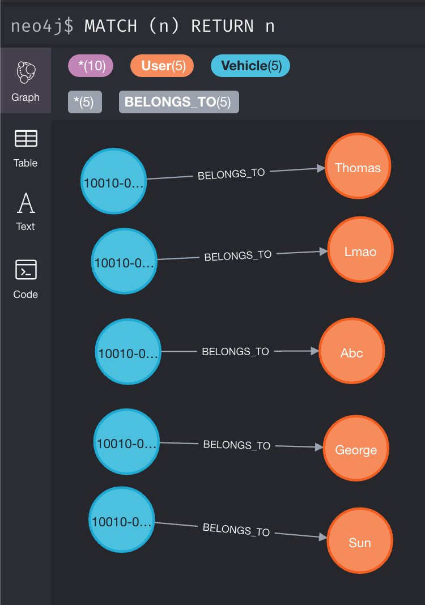

# Loop Mid Interview Test - ETL and Display

### DB & ETL portion
- First start up postgres in a docker container
- Write a script (language of your choosing ) to import the SQL into the db
  > [Hint] To execute a command in the container use `docker exec {dockerContainerId}`
- Write a script to export to a CSV from the database too `.scripts/neo4j/import`
  > [Hint] Don't miss, this folder is mounted into Neo4j when it loads up
- Start Neo4j
- Transform data and Load into Neo4j with relationships.
  This will be where you spend most of your time writing cypher query.

  When you're done it should look _something_ like:
  `MATCH (User:u)-[:owns]->(Vehicle:v) return u, v`
  OR: `MATCH (n) return n`
  > The following is a visualization with the neo4j browser, not your expected UI
  </br>
  
  

### Server Portion
- Start Server
- Verify data is being exposed to requests
- Handle data requests and respond to client requests with specificed data

### Client Portion
- Build client of your choosing to display the data. Something simple that lists users, and their vehicles
- Using frameworks is permitted here but not required ( I mean VanillaJS, no jQuery will be accepted )


#### **Docker Cheat Sheet**
```bash
$ docker-compose up -d {service}         # The -d will run it in the background,
                                         # so it does not close when you attempt
                                         # to exit back to the terminal

$ docker-compose stop {service}          # Stops the service
$ docker-compose rm {service}            # Removes the service's associated container
$ docker-compose logs -f {service}       # The -f will follow
$ docker-compose ps                      # Lists the services
$ docker ps                              # Lists the containers
$ docker exec -i {containerId} {command} # Runs command in conatiner
```      